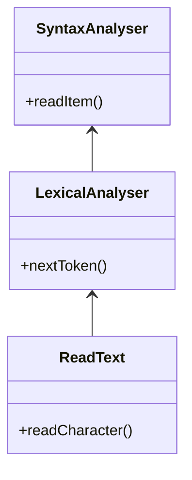
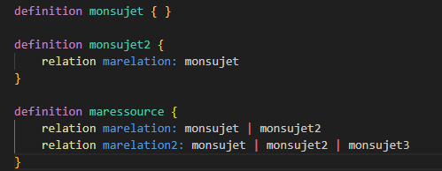

# Zanzibar SpiceDB-like reader in less than 350 lines of golang

I wanted to offer in Golang the example of a small handwritten analyzer.
(This is an exercise I often do when learning a new language)
Since I've been working with SpiceDB for a while, the purpose of this example is to provide sample code that implements a subset of the SpiceDB grammar.

SpiceDB is Google Zanzibar like and is available under the permissive Apache License 2.0. 

Google Zanzibar Authorization System is a scalable service for managing fine-grained access control using Relationship-Based Access Control (ReBAC)
(See https://github.com/jeandi7/prologzanzibar)

The program does nothing more than respond if the text submitted to it is correct with regard to the grammar.

No semantic analysis for now.


So i give myself the following BNF LL(1) grammar:


```
// Zanzibar restricted BNF grammar
// SpiceDB like
// Only relations are declared (not permissions)

<Zschema> ::= <Zdef>*
<Zdef> ::= "definition" <Zname> "{" <Zbody> "}"
<Zname> ::= <identifier>
<Zbody> ::= <Zrelation>*
<Zrelation> ::= "relation" <Zname> ":" <Zname> ("|" <ZName)*
<Zname> ::= <identifier>
<identifier> ::= [a-zA-Z_][a-zA-Z0-9_]*

```

# Zanzibar Reader

Implementation is made with lexical analysis and syntaxic analysis



# Example

You must provide either -schema (a string line) or -fschema (a file), but not both.

go run zreader.go -schema="definition monsujet { } definition monsujet2 { } definition monsujet3 { relation marelation: monsujet | monsujet2  relation marelation2: monsujet | monsujet2 | monsujet3  }"

response: parsed schema OK: [{monsujet []} {monsujet2 []} {monsujet3 [{marelation [monsujet monsujet2]} {marelation2 [monsujet monsujet2 monsujet3]}]}]

go run  zreader.go -fschema "./zschema.zed"

I keep the .zed extension for the reading of a file that allows me to keep the spicedb coloring thanks to the Visio Authzed-language-support plug-in




response: parsed schema OK: [{monsujet []} {monsujet2 [{marelation [monsujet]}]} {maressource [{marelation [monsujet monsujet2]} {marelation2 [monsujet monsujet2 monsujet3]}]}]

go run zreader.go -help

I also provide a small automated test in the zinterpreter_test.go with 7 different schemas to read.

# 

About Zanzibar : https://storage.googleapis.com/pub-tools-public-publication-data/pdf/0749e1e54ded70f54e1f646cd440a5a523c69164.pdf

About SpiecDB : https://authzed.com/blog/spicedb-is-open-source-zanzibar#everybody-is-doing-zanzibar-how-is-spicedb-different
